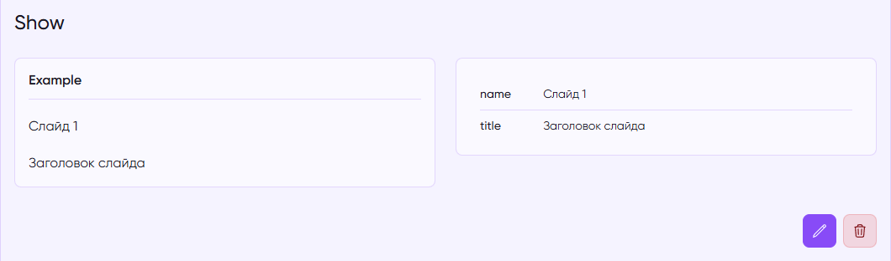

# FAQ

## Как использовать отношения в MoonShine?

**Eloquent** отношения в **MoonShine** реализуются через соответствующие одноименные поля.

**MoonShine** поддерживает все возможные отношения: `BelongsTo`, `BelongsToMany`, `HasOne`, `HasMany` и другие.

Рассмотрим использование полей отношений на примере `BelongsTo`. Например, у вас есть модели `Post` и `Author`, где каждый пост принадлежит одному автору.

```php filename:app/Models/Post.php
// torchlight! {"summaryCollapsedIndicator": "namespaces"}
// [tl! collapse:1]
use Illuminate\Database\Eloquent\Relations\BelongsTo;

public function author(): BelongsTo
{
    return $this->belongsTo(Author::class);
}
```

```php filename:app/MoonShine/Resources/Post/PostResource.php
// torchlight! {"summaryCollapsedIndicator": "namespaces"}
// [tl! collapse:1]
use MoonShine\Laravel\Fields\Relationships\BelongsTo;

public function formFields(): array
{
    return [
        // ...
        BelongsTo::make('Author', 'author', AuthorResource::class),
    ];
}
```

Подробнее о каждом типе связи читайте в разделах соответствующих полей в документации.

## Как работать с JSON полями?

Смотрите раздел поля [Json](/docs/{{version}}/fields/json).

## Как добавить стили или классы к полям или компонентам?

[Добавление класса](/docs/{{version}}/components/attributes#class).

[Добавление стиля](/docs/{{version}}/components/attributes#style).

## Как использовать реактивность полей?

Общая информация о [реактивности полей](/docs/{{version}}/fields/basic-methods#reactive).

Вариант применение реактивности на примере поля [Slug](/docs/{{version}}/fields/slug#live).

## Как настроить права доступа для разных ролей пользователей?

На тему авторизации читайте соответствующий [раздел документации](/docs/{{version}}/model-resource/authorization).

Для интеграции управления доступом на основе ролей в **MoonShine**,
вы можете использовать сторонний пакет [moonshine-roles-permissions](https://getmoonshine.app/plugins/moonshine-roles-permissions).

## Как правильно использовать события ресурса (beforeCreating, afterCreated и т.п.)?

Смотрите [ModelResource > События](/docs/{{version}}/model-resource/events).

## Как настроить фильтрацию в ресурсе?

Смотрите [ModelResource > Фильтры](/docs/{{version}}/model-resource/filters).

## Как реализовать сортировку записей перетаскиванием?

Компонент **TableBuilder** имеет метод [reorderable()](/docs/{{version}}/components/table-builder#drag-and-drop-sorting),
который добавляет возможность сортировки строк перетаскиванием.

Вот [рецепт](/docs/4.x/recipes/reorderable-resource) реализации сортировки перетаскиванием в ресурсе.

## Как кастомизировать внешний вид админ-панели?

Есть много способов изменить внешний вид шаблонов в **MoonShine**. Читайте разделы “Внешний вид” в документации.

## Как сохранить ID авторизованного пользователя при создании записи?

В следующем примере по умолчанию автором назначается текущий аутентифицированный пользователь.

```php
public function formFields(): array
{
    return [
        // ...
        BelongsTo::make('Author', resource: UserResource::class)
            ->default( request()->user() ),
    ];
}
```

Также можно добавить скрытое поле и заполнить его значением ID пользователя из реквеста.

```php
Hidden::make('Author')
    ->fill( auth()->id() )
```

Так же в разделе [ModelResource > События](/docs/{{version}}/model-resource/events) показан пример добавления поля в реквест через события.

## Как правильно работать с дробными числами в поле Number?

Достаточно указать нужных шаг с помощью метода [step()](/docs/{{version}}/fields/number#step), например "0.01".

## Как настроить асинхронный поиск в Select полях?

Смотрите раздел [Select](/docs/{{version}}/fields/select#async).

## Как изменить или скрыть элементы меню в зависимости от прав пользователя?

Смотрите [рецепт](/docs/{{version}}/recipes/menu-authorization).

## Как изменить формат даты в полях Date?

Смотрите раздел поля [Date](/docs/{{version}}/fields/date#format).

## Как изменить логотип и фавикон в админ-панели?

Логотип можно изменить в [конфигурации](/docs/{{version}}/configuration#logo).

Фавикон можно заменить в `Layout` в компоненте [Favicon](/docs/{{version}}/components/favicon#assets).

## Как реализовать множественную загрузку файлов?

Смотрите раздел поля [File](/docs/{{version}}/fields/file#multiple).

## Как настроить импорт/экспорт данных в CSV или Excel?

Смотрите раздел [Импорт / Экспорт](/docs/{{version}}/model-resource/import-export).

## Как работать с Markdown полями в MoonShine?

Вы можете воспользоваться пакетом [moonshine-software/easymde](https://github.com/moonshine-software/easymde).

## Как кастомизировать хлебные крошки в MoonShine?

Хлебные крошки можно переопределять на отдельных [страницах](/docs/{{version}}/page/index#breadcrumbs).

[Рецепт](/docs/{{version}}/recipes/custom-breadcrumbs), как изменять хлебные крошки из ресурса для отдельных страниц.

## Как убрать массовые действия и чекбоксы с индексной страницы?

[ModelResource > Основы](/docs/{{version}}/model-resource/index#active-actions).

## Как настроить глобальный поиск в MoonShine?

[model-resource/search#global](/docs/{{version}}/model-resource/search#global).

## Как реализовать кастомные поля ввода в MoonShine?

Достаточно расширить базовый класс `Field` или класс любого из имеющихся полей и добавить\переопределить нужный вам функционал.
Например, подключить другой **view**.

## Как использовать QueryTags в MoonShine?

[model-resource/query-tags](/docs/{{version}}/model-resource/query-tags).

## Как добавить или изменить кнопки в FormBuilder?

[components/form-builder#buttons](/docs/{{version}}/components/form-builder#buttons).

## Как настроить отображение полей в зависимости от значения другого поля?

[fields/basic-methods#show-when](/docs/{{version}}/fields/basic-methods#show-when).

[Рецепт с примеромами](/docs/{{version}}/recipes/select).

## Как изменить или удалить стандартные кнопки действий в ресурсе?

[model-resource/buttons](/docs/{{version}}/model-resource/buttons).

## Как работать с полями Enum в MoonShine?

[fields/enum](/docs/{{version}}/fields/enum).

## Как добавить кастомные страницы в MoonShine?

[page/index#create](/docs/{{version}}/page/index#create).

## Как работать с мягким удалением (soft delete) в MoonShine?

[recipes/soft-deletes](/docs/{{version}}/recipes/soft-deletes).

Также есть [статья](https://cutcode.dev/articles/softdeleting-v-moonshine-v3) с более подробным описанием.

## Как настроить кастомные маршруты в MoonShine?

[advanced/routes](/docs/{{version}}/advanced/routes).

## Как работать с полем Switcher в формах и фильтрах?

`Switcher` - это тот же `Checkbox`, только в другом визуальном оформлении.

## Как реализовать кастомную аутентификацию в MoonShine?

[security/authentication#customization](/docs/{{version}}/security/authentication#customization).

## Как настроить отображение Badge в зависимости от значения?

У полей есть метод `badge()`, который может принимать замыкание, возвращающее код цвета: [fields/basic-methods#badge](/docs/{{version}}/fields/basic-methods#badge).

Так же смотрите раздел поля [Enum](/docs/{{version}}/fields/enum#color).

## Как добавить свои элементы на детальную страницу или изменить её?

Если стандартного табличного вида детальной страницы недостаточно, вы можете переопределить `DetailPage` и собрать страницу из нужных вам компонентов.

Это удобно, когда нужно:

- добавить собственные блоки рядом с полями;
- изменить порядок отображения элементов;
- вывести связанные данные, таблицы, кнопки или любые дополнительные виджеты;
- полностью адаптировать под сценарий конкретного ресурса.



```php
class ExampleDetailPage extends DetailPage
{
    protected function mainLayer(): array
    {
        return [
            $this->getDetailComponent(),
            LineBreak::make(),
            ...$this->getTopButtons(),
        ];
    }

    public function getDetailComponent(bool $withoutFragment = false): ComponentContract
    {
        return Fragment::make([
            Grid::make([
                Column::make([
                    $this->fieldsOne(),
                ], colSpan: 6),

                Column::make([
                    $this->fieldsTwo(),
                ], colSpan: 6),
            ]),
        ])->name('crud-detail');
    }

    protected function fieldsOne()
    {
        return FieldsGroup::make([
            Box::make('Example', [
                Text::make('name'),
                Text::make('title'),
            ]),
        ])
            ->fill($this->getItem()->toArray(), $this->getResource()->getCastedData())
            ->previewMode();
    }

    protected function fieldsTwo()
    {
        $resource = $this->getResource();

        return Box::make([
            TableBuilder::make([
                Text::make('name'),
                Text::make('title'),
            ])
                ->cast($resource->getCaster())
                ->items([$resource->getItem()])
                ->vertical()
                ->simple()
                ->preview()
                ->class('table-divider'),
        ]);
    }
}
```

В этом примере:

- `mainLayer()` задаёт общую структуру страницы;
- `getDetailComponent()` отвечает за основной блок с содержимым;
- `Fragment`, `Grid` и `Column` помогают собрать кастомную сетку;
- `FieldsGroup` и `Box` позволяют удобно группировать поля;

Таким образом, можно не только добавить свои элементы на детальную страницу, но и полностью перестроить её под нужный сценарий: от компактного блока с полями до полноценной панели с дополнительной
информацией и действиями.
